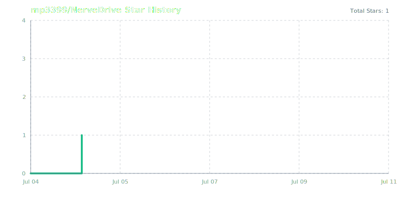

<div align="center">
  
  <h1>NerveDrive</h1>
  <p>Private, in-browser Apple Health and Android Health Connect telemetry intelligence dashboard.</p>

  [](https://react.dev)
  [](https://www.typescriptlang.org)
  [](https://vitejs.dev)
  [](https://tailwindcss.com)
  [](https://github.com/mp3399/NerveDrive/stargazers)
</div>

---

NerveDrive is a flagship health telemetry dashboard designed to provide a cohesive, premium, and private experience for analyzing your mobile health data. 

**Zero data leaves your device.** NerveDrive processes your Apple Health export `.zip` or Android Health Connect `.db` files entirely within your web browser using advanced client-side Web Workers, ensuring complete data privacy.

---

## ✨ Features

### Implemented
- **Universal Data Support**: Upload raw `.zip` or SQLite `.db` files from Apple Health or Android Health Connect to instantly visualize your biometric history.
- **Biometric Correlation Engine**: An analytical engine that finds statistical correlations (e.g., Sleep vs HRV) in your telemetry and provides physiological explanations.
- **AI Prediction Center**: Simulate lifestyle modifications (sleep, cardio, protein intake) and watch a multi-variable weighted prediction model forecast your Biological Age and Recovery Index.
- **Interactive Body Systems Map**: An elegant anatomical map providing insights into your Cardiovascular, Respiratory, and Muscular systems.
- **AI Coach**: Actionable, ROI-ranked physiological recommendations based on your unique data deviations.

### In Development
- **Continuous Glucose Ingestion**: Parsers for Abbott Freestyle Libre and Dexcom continuous glucose telemetry.
- **Advanced Export System**: High-resolution, doctor-shareable PDF reports of your core dashboard widgets.

---

## 🔒 Privacy Architecture

> [!IMPORTANT]
> Your health data is your most sensitive personal information. NerveDrive is built with a strict zero-upload architecture.

- **100% Client-Side Processing**: All parsing, statistical analysis, and AI coaching logic runs locally in your browser using WebAssembly (`sql.js`) and Web Workers.
- **No Cloud Storage**: We do not maintain a database of user data.
- **No Analytics SDKs**: NerveDrive does not include Google Analytics, Mixpanel, or any tracking software.

---

## 🛠 Tech Stack

- **Framework**: React 18
- **Build Tool**: Vite
- **Language**: TypeScript
- **Styling**: Tailwind CSS & Framer Motion
- **Data Ingestion**: sql.js (WebAssembly) & papaparse (Web Workers)
- **Data Visualization**: Apache ECharts

---

## 🚀 Installation & Local Development

1. **Clone the repository:**
   ```bash
   git clone https://github.com/mp3399/NerveDrive.git
   cd NerveDrive
   ```

2. **Install dependencies:**
   Ensure you have Node.js version 18 or higher installed.
   ```bash
   npm install
   ```

3. **Start the development server:**
   ```bash
   npm run dev
   ```

4. **Open in browser:**
   Navigate to `http://localhost:5174`

---

## 🏗 Build Instructions

To build the project for production, run:

```bash
npm run build
```

This compiles TypeScript and bundles the assets via Vite into the `dist/` directory.

---

## 🗺 Production Roadmap

NerveDrive is actively evolving. Our roadmap is organized into logical phases to ensure a stable, mature product lifecycle.

### Phase 1: Foundation (Completed)
- Apple Health `.zip` parsing and baseline analysis.
- Dashboard UI with theme selection.
- Basic export capabilities.

### Phase 2: Analytics (In Progress)
- Period-over-period biometric comparison.
- ECG waveform viewer integration.
- GPX workout-route maps.

### Phase 3: Health Intelligence (Planned)
- Saved snapshots via `localStorage` (opt-in, strictly on-device).
- Comprehensive Vitest coverage for the analysis engine.
- Route-level code splitting for visualization libraries.

### Phase 4: AI Predictions (Planned)
- On-device WebGPU Local LLM summary for a natural language narrative.
- Dynamic health scoring algorithms based on longevity studies.

### Phase 5: Android Support (Planned)
- Built-in backup schema parsers for Health Connect.
- Direct database loading improvements.

### Phase 6: Medical Export (Planned)
- Standardized, doctor-shareable one-page PDF generation.
- Automated biomarker flagging for clinical review.

### Phase 7: Research Dashboard (Research)
- Cohort analysis models.
- Integration with academic health study schemas.

### Phase 8: Developer SDK (Future)
- Plugin system for custom telemetry formats.
- API specifications for private local integrations.

---

## 🤝 Contributing

Contributions are welcome and appreciated. To maintain repository quality, please adhere to our project guidelines.

1. Fork the Project.
2. Read the `AGENTS.md` and `THINKING_MODEL.md` documentation for styling and architecture constraints.
3. Create your Feature Branch (`git checkout -b feature/AmazingFeature`).
4. Commit your Changes (`git commit -m 'feat: add amazing feature'`).
5. Push to the Branch (`git push origin feature/AmazingFeature`).
6. Open a Pull Request.

---

## Star History

<a href="https://star-history.com/#mp3399/NerveDrive&Date">
  
</a>
